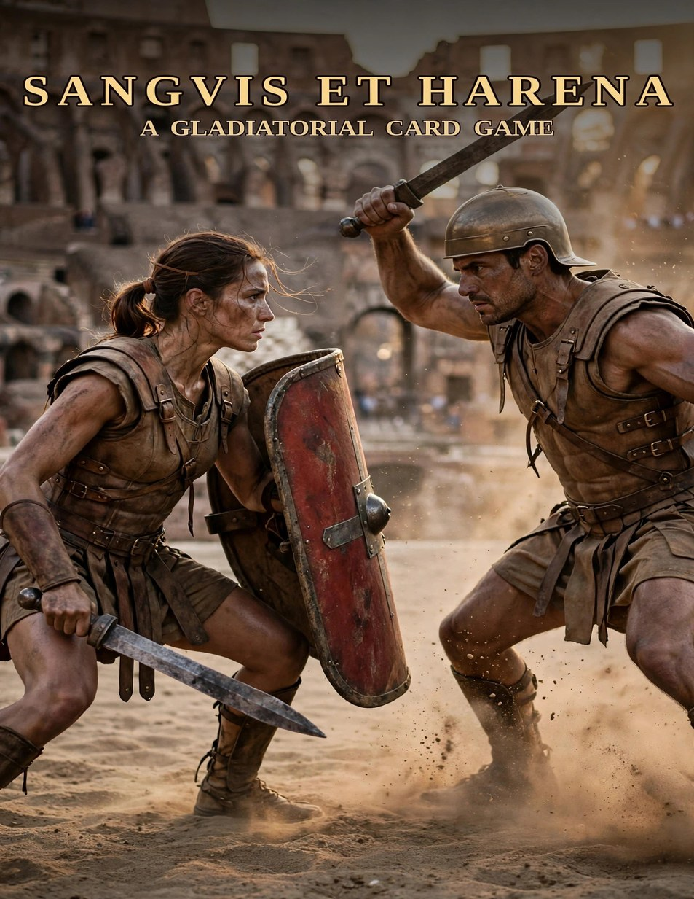
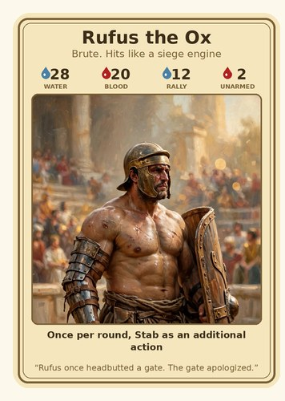
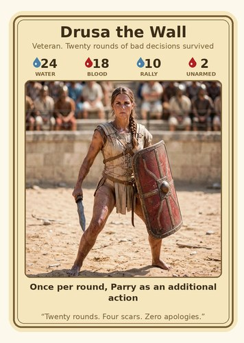
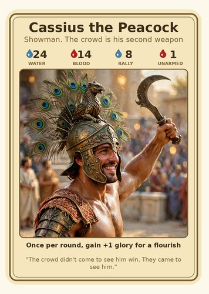
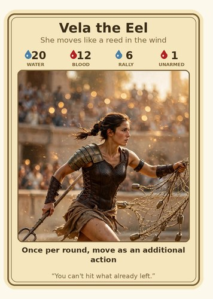

# Sanguis et Harena

Wicked Combo presents

Sanguis et Harena

A tactical card game of timing, positioning, and nerve.

<a class="sh-cta" href="https://www.drivethrurpg.com/en/product/588027/sanguis-harena">Get the Game on DriveThruRPG</a>

36-card print-and-play deck &mdash; $14.99 &middot; rulebook PDF included

<h2>The System</h2>

CHOOSE&rarr;
SHOW&rarr;
ACT&rarr;
BURN&rarr;
REPEAT

Each round runs six seconds. Every second, you secretly choose one card and reveal it together with your opponents &mdash; then resolve everything live on your burn-down track. Cards slide down each second; when they burn off, you pay their water and score their glory.

<strong>Water</strong> fuels every card. <strong>Glory</strong> rewards bold play. <strong>Positioning</strong> decides every exchange. Most glory after six rounds wins &mdash; unless you finish your rivals first.

<h2>The Champions</h2>

<h3>Rufus the Ox</h3>

Brute, built like a siege engine.

Once per round, Stab as an additional action.

&ldquo;Rufus once headbutted a gate. The gate apologized.&rdquo;

<h3>Drusa the Wall</h3>

Veteran. Twenty rounds of bad decisions survived.

Once per round, Parry as an additional action.

&ldquo;Twenty rounds. Four scars. Zero apologies.&rdquo;

<h3>Cassius the Peacock</h3>

Showman. The crowd is his second weapon.

Once per round, gain +1 glory for a flourish.

&ldquo;The crowd didn't come to see him win. They came to see him.&rdquo;

<h3>Vela the Eel</h3>

She moves like a reed in the wind.

Once per round, move as an additional action.

&ldquo;You can't hit what already left.&rdquo;

<h2>The Cards</h2>

<h2 style="margin-top:0;">Get in the Arena</h2>

36 poker-size cards &middot; 10-page full-color rulebook &middot; 2&ndash;6 players, ages 12+

$14.99

<a class="sh-cta" href="https://www.drivethrurpg.com/en/product/588027/sanguis-harena">Get the Game on DriveThruRPG</a>

Just want the rules? <a href=".attachments/sanguis-et-harena-rulebook.pdf">Download the free rulebook (PDF)</a>

Card art is AI-generated placeholder art, disclosed per DriveThruRPG policy. Wicked Combo is commissioning human artists for future printings &mdash; this release funds that work.

