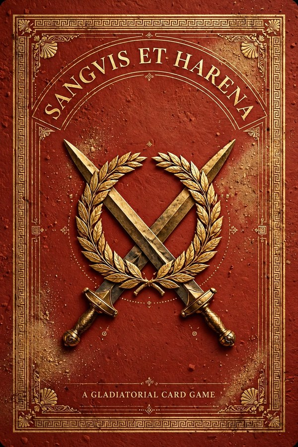
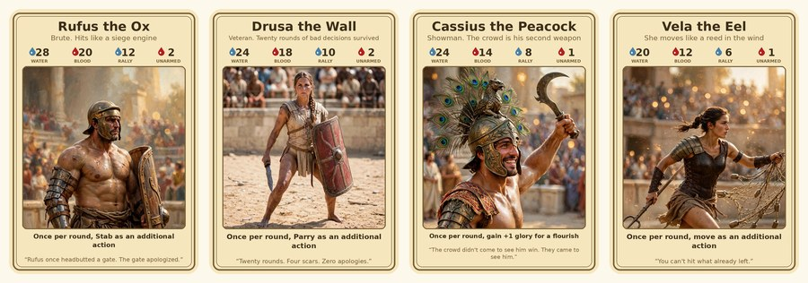
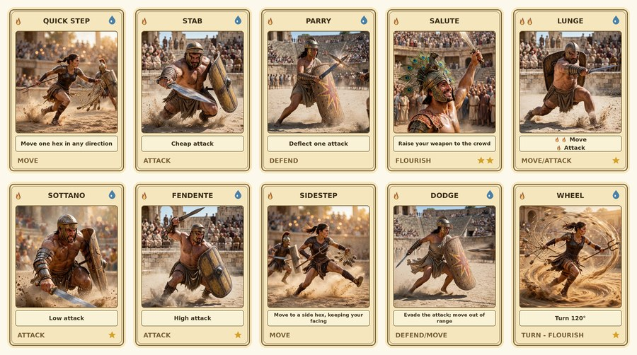
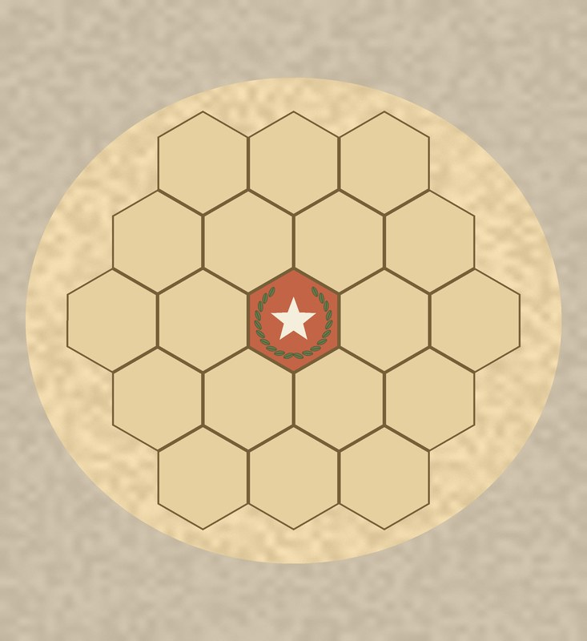

# Press Kit — Sanguis et Harena

*Everything on this page is free to use for coverage of the game. Click any image or link to download the full-resolution file.*

## The game

**Sanguis et Harena** (*blood and sand*) is a tactical card game of timing, positioning, and nerve. Each round runs six seconds: every second, you secretly choose one card and reveal it together with your opponents, then resolve everything live on your burn-down track. Water fuels every card. Glory rewards bold play. Positioning decides every exchange.

- **Designer:** Mark Davis · **Publisher:** [Wicked Combo](https://wickedcombo.com/)
- **Players:** 2–6 · **Ages:** 12+ · **Deck:** 36 poker-size cards + 10-page rulebook
- **Price:** $14.99 print-on-demand · **Available:** [DriveThruRPG](https://www.drivethrurpg.com/en/product/588027/sanguis-harena)
- **Release:** v0.2.0, October 2026

## Cover art

[Download cover (.attachments/sanguis-et-harena-listing-cover-v0.2.0.jpg)]

## Gallery

## Downloads

- [Rulebook PDF — free](.attachments/sanguis-et-harena-rulebook-v0.2.0.pdf)
- [Full card print PDF](.attachments/sanguis-et-harena-cards-print-v0.2.0.pdf)
- [Card back](.attachments/sanguis-et-harena-gallery-1-card-back-v0.2.0.jpg) · [Champions](.attachments/sanguis-et-harena-gallery-2-champions-v0.2.0.jpg) · [Action cards](.attachments/sanguis-et-harena-gallery-3-cards-v0.2.0.jpg) · [Arena](.attachments/sanguis-et-harena-gallery-4-arena-v0.2.0.jpg)
- [Wicked Combo logo](.attachments/wicked-combo-publisher-logo-v0.2.0.png)
- [Release manifest + checksums](.attachments/MANIFEST.md)

*Note: launch card art is AI-generated placeholder art, disclosed per DriveThruRPG policy. Wicked Combo is commissioning human artists for future printings.*
